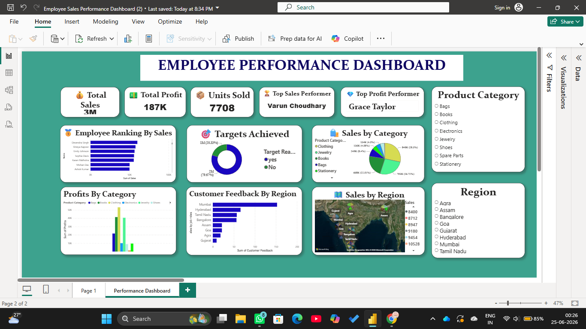

Employee Sales Performance Dashboard

A Power BI dashboard designed to analyze employee sales performance using interactive visualizations.

Featuring:
- Cards for Total Sales, Total Profit, Units Sold, Top Sales Performer, and Top Profit Performer
- Employee Ranking by Sales
- Target Achievement Analysis
- Sales and Profit Analysis by Product Category
- Customer Feedback by Region
- Regional Sales Map
- Interactive Filters for Product Category and Region

### Tools Used
- Power BI Desktop
- Microsoft Excel

## Dashboard Preview

